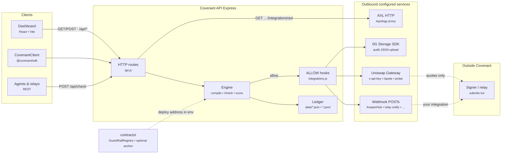

# Covenant

**What this is.** Covenant is a **policy enforcement and audit gate** for autonomous agents that might move funds or call DeFi routers. Operators define spend limits, allowed protocols/pairs, and challenge rules; agents (or relays) send proposed actions to **`POST /api/check`** *before* execution. Allowed decisions can trigger **webhooks**, **Uniswap Trading API quotes** (server-side), **Gensyn AXL topology** (HTTP bridge proxy), and **0G Storage** audit uploads when you configure credentials. Covenant does **not** replace your signer or KeeperHub—it decides and records; your stack executes.

**Implementation stack:** natural-language policy compilation to structured rules, file-backed ledger with hash-linked decisions (swap for a DB in production), React dashboard, Hardhat **`GuardRailRegistry`**, Docker Compose, TypeScript **`CovenantClient`** SDK — all configurable via **`ENVIRONMENT.md`** and `*.env.example` files (nothing security-sensitive baked into source).

See [`ENVIRONMENT.md`](ENVIRONMENT.md) for every variable.

## Architecture



- **Decision boundary:** Covenant returns **allow/deny** and persists an audit trail; **execution** (broadcasting swaps, KeeperHub fulfillment) stays in **`Exec`** unless you explicitly wire hooks to automate it.
- **Docker:** **`docker compose`** runs API + **`web`** (`nginx`): static UI + proxy **`/api/`** → API; **`covenant_data`** volume mounts API **`/app/data`**.
- **Config:** Env-driven URLs and keys — see **`ENVIRONMENT.md`** (nothing sensitive in `/client` bundle except optional `VITE_COVENANT_API_KEY`).

## Repo layout

| Path | Role |
|------|------|
| [`client/`](client/) | Vite + React dashboard |
| [`server/`](server/) | Express API, file-backed store under `server/data/` (gitignored locally) |
| [`contracts/`](contracts/) | Hardhat — `GuardRailRegistry` |
| [`packages/sdk-ts/`](packages/sdk-ts/) | TypeScript `CovenantClient` |

## Quick start

1. **Secrets:** copy each `*.env.example` → `.env` or `.env.local` (never commit real keys).

2. **API**

   ```bash
   cd server && npm install && npm run node
   ```

3. **UI** (another terminal)

   ```bash
   cd client && npm install && npm run dev
   ```

4. **Validate** (from repo root)

   ```bash
   npm install   # optional: root has orchestration scripts only
   npm run validate
   ```

5. **Docker**

   ```bash
   npm run compose:up
   ```

   UI: [http://localhost:8080](http://localhost:8080) (API proxied at `/api`).

## Documentation

| Doc | Contents |
|-----|----------|
| [**ENVIRONMENT.md**](ENVIRONMENT.md) | Variables, auth, integrations, persistence, `.gitignore` notes |
| [`client/README.md`](client/README.md) | Frontend dev |
| [`contracts/README.md`](contracts/README.md) | Hardhat |
| [`packages/sdk-ts/README.md`](packages/sdk-ts/README.md) | NPM-style SDK usage |
